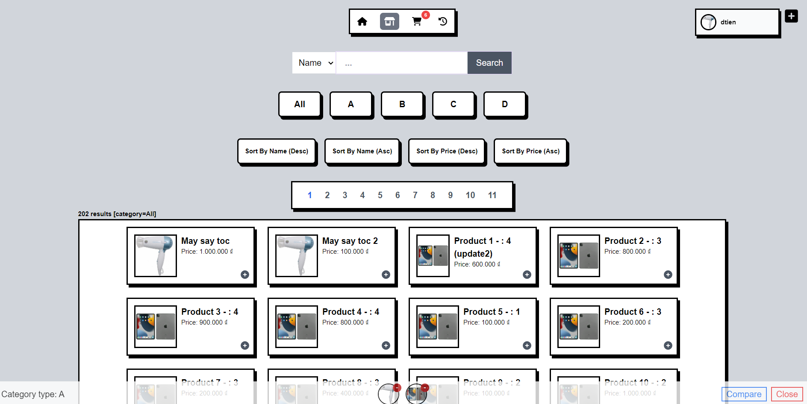
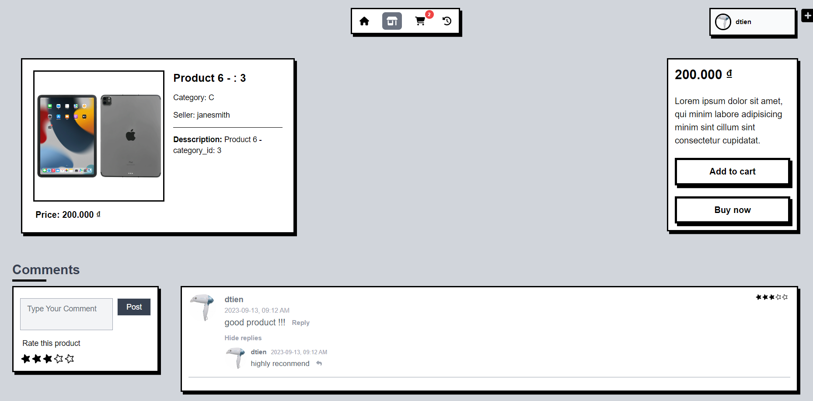
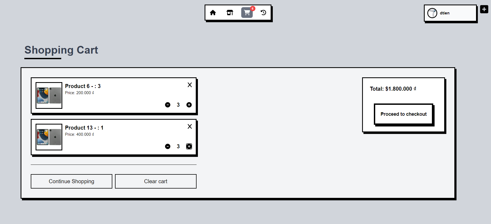
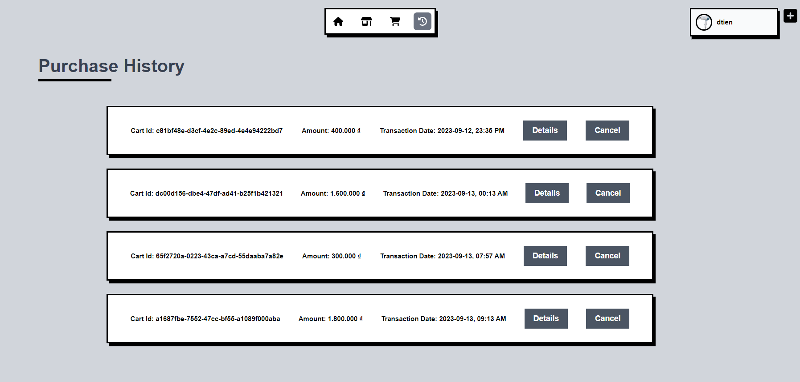

## springmvc-react-jwt

- Ecommerce Website using: SpringMVC, ReactJS, TailwindCSS, JWT.

#### Quickstart

1. Clone this repo
2. Setup client
   ```bash
   cd client
   npm install
   npm run dev
   ```
3. Setup server (See server/ecommerce/CONTRIBUTING.md)

## Images

**Shopping Page**



---

**Others**







---

